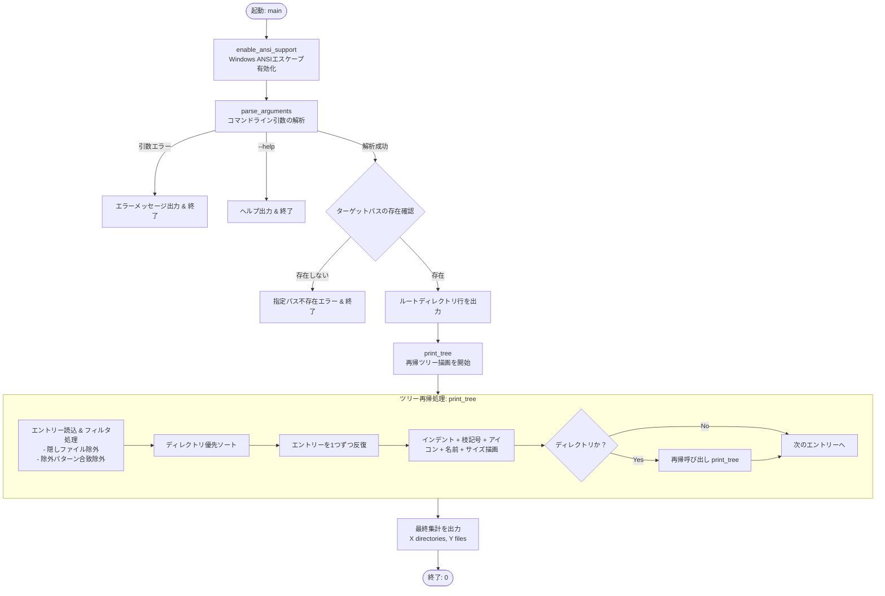
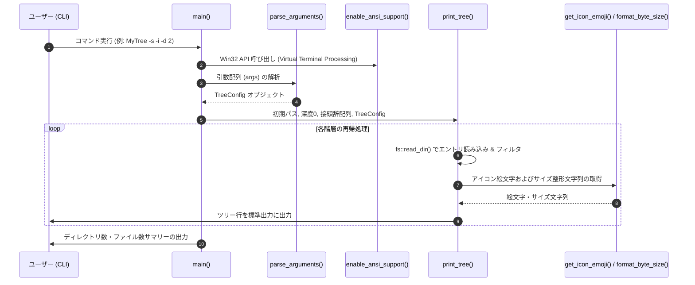

# System Diagrams (DIAGRAM.md) - MyTree

本文書では、`MyTree` の実行フローおよびコンポーネント構造を Mermaid ダイアグラムで可視化します。

---

## 1. 実行フローチャート

```mermaid
flowchart TD
    Start([起動: main]) --> EnableANSI[enable_ansi_support<br/>Windows ANSIエスケープ有効化]
    EnableANSI --> ParseArgs[parse_arguments<br/>コマンドライン引数の解析]
    
    ParseArgs -->|引数エラー| ErrExit[エラーメッセージ出力 & 終了]
    ParseArgs -->|--help| HelpExit[ヘルプ出力 & 終了]
    ParseArgs -->|解析成功| CheckPath{ターゲットパスの存在確認}
    
    CheckPath -->|存在しない| PathErrExit[指定パス不存在エラー & 終了]
    CheckPath -->|存在| PrintRoot[ルートディレクトリ行を出力]
    
    PrintRoot --> PrintTree[print_tree<br/>再帰ツリー描画を開始]
    
    subgraph TreeRecursion [ツリー再帰処理: print_tree]
        FilterEntries[エントリー読込 & フィルタ処理<br/>- 隠しファイル除外<br/>- 除外パターン合致除外]
        SortEntries[ディレクトリ優先ソート]
        LoopEntries[エントリーを1つずつ反復]
        RenderLine[インデント + 枝記号 + アイコン + 名前 + サイズ描画]
        IsSubDir{ディレクトリか？}
        RecurseSub[再帰呼び出し print_tree]
        
        FilterEntries --> SortEntries
        SortEntries --> LoopEntries
        LoopEntries --> RenderLine
        RenderLine --> IsSubDir
        IsSubDir -->|Yes| RecurseSub
        IsSubDir -->|No| NextEntry[次のエントリーへ]
        RecurseSub --> NextEntry
    end
    
    PrintTree --> TreeRecursion
    TreeRecursion --> PrintSummary[最終集計を出力<br/>X directories, Y files]
    PrintSummary --> End([終了: 0])
```

---

## 2. モジュール間データフロー図

```mermaid
sequenceDiagram
    autonumber
    participant CLI as ユーザー (CLI)
    participant Main as main()
    participant ArgParser as parse_arguments()
    participant WinAPI as enable_ansi_support()
    participant Engine as print_tree()
    participant Helper as get_icon_emoji() / format_byte_size()

    CLI->>Main: コマンド実行 (例: MyTree -s -i -d 2)
    Main->>WinAPI: Win32 API 呼び出し (Virtual Terminal Processing)
    Main->>ArgParser: 引数配列 (args) の解析
    ArgParser-->>Main: TreeConfig オブジェクト
    Main->>Engine: 初期パス, 深度0, 接頭辞配列, TreeConfig
    loop 各階層の再帰処理
        Engine->>Engine: fs::read_dir() でエントリ読み込み & フィルタ
        Engine->>Helper: アイコン絵文字およびサイズ整形文字列の取得
        Helper-->>Engine: 絵文字・サイズ文字列
        Engine->>CLI: ツリー行を標準出力に出力
    end
    Main->>CLI: ディレクトリ数・ファイル数サマリーの出力
```
